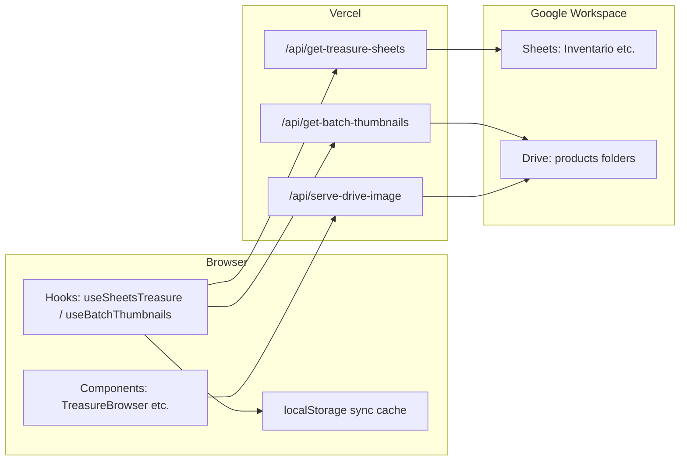

# Tierra Madre Studio — Architecture

This document describes how data flows through the app at a high level. For commands and env vars, see [CLAUDE.md](./CLAUDE.md).

## Stack

- **Frontend**: React 18 + TypeScript, Vite, Material UI v6, React Router 7, Framer Motion.
- **Backend**: Vercel serverless functions under `api/` (Node). No traditional DB: **Google Sheets** hold tabular data; **Google Drive** holds media and generated files.
- **Auth**: Google OAuth on the client; `/api/validate` resolves roles from Sheets.

## Data flow (catalog)

1. **Inventory JSON**: `GET /api/get-treasure-sheets` reads the Sheets inventory, maps rows to `TreasureItem`-shaped objects (`api/types/api-contracts.ts` aligns with `src/types/index.ts`).
2. **Thumbnails map**: `GET /api/get-batch-thumbnails` scans Drive `products/` folders and returns proxy URLs for grid thumbnails.
3. **Images**: The UI loads images through `/api/serve-drive-image?fileId=…` (resize, WebP when `Accept: image/webp`, HEIC fallbacks).

Hooks use **`fetchWithRetry`** (backoff on 5xx/429). Optional **`notifyOnFailure`** surfaces repeated failures via **NotificationContext** through **`fetchFailureBridge`** (no circular import from utils to React).

## Frontend structure

- **Entry**: `src/main.tsx` → providers (language, theme, auth) → `App.tsx`.
- **Shell**: `AppShellProviders` composes tracking, notifications, loading, etc. Route tree in `App.tsx` with lazy routes (`lazyWithRetry`).
- **iOS-style UI**: `IOSLayout` + design tokens from `src/design-system/index.ts` (barrel import only).

## API layer

- Shared helpers: `api/_lib/` (`withApiHandler`, CORS, Sheets/Drive helpers). Typed surface in `api/_lib/index.d.ts`.
- Critical typed routes: `get-treasure-sheets.ts`, `cotizacion-save.ts`, `get-batch-thumbnails.ts` (TypeScript); other endpoints remain `.js` with JSDoc where needed.

## PDFs

Heavy clients (**jsPDF**, **html2canvas**) are loaded on demand: `jspdf-loader.ts`, dynamic `import()` in slide export, receipt export, and quotation export paths so they are not pulled into the initial bundle unnecessarily.

## Tests

- **Unit**: `npm run test:unit` (Vitest) — see `tests/*.test.ts`.
